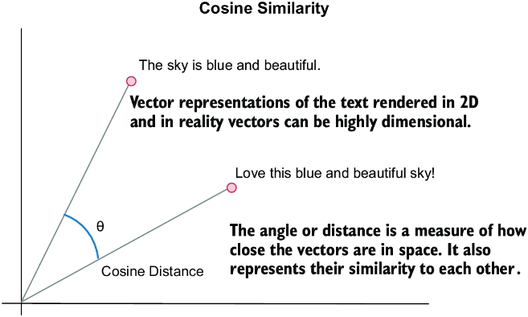

# Cosine similarity :
###### Ref : https://www.manning.com/books/ai-agents-in-action
### This project folder explain the vectorisation and cosine similarity
* First Vectorisation is basically a tokenization of text special tokenisation help in managing the data 
* And pattern matching with various also
* semantic vector, or a representation of text that can then be used to perform distance or similarity matching
* TF–IDF is a classic measure of understanding one document’s importance within a set of documents.
```commandline
Term Frequency measures how frequently a term occurs in a document

Number of times blue appears in the document: 1

Total number of words in the document: 6

TF = 1 ÷ 6TF = .16

IDF = log(Total number of documents ÷ Number of documents containing the word)

TF–IDF = TF × IDF
TF = 1 ÷ 6
IDF = log10 (8 ÷ 4)

Higher TF–IDF scores imply greater importance
```
* **Cosine similarity** : is a measure used to calculate the cosine of the angle between two nonzero vectors in a multidimensional space, indicating how similar they are, irrespective of their size.
* A cosine distance of 0 means identical items, and 2 indicates complete opposites.
* 

* TF-IDF : it’s unreliable because it only counts word frequency and doesn’t understand the relationships between words
* At a basic level, an agent profile is a set of prompts describing the agent. 
* It may include other external elements related to actions/tools, knowledge, memory, reasoning, evaluation, planning, and feedback. 
* The combination of these elements comprises an entire agent prompt profile.