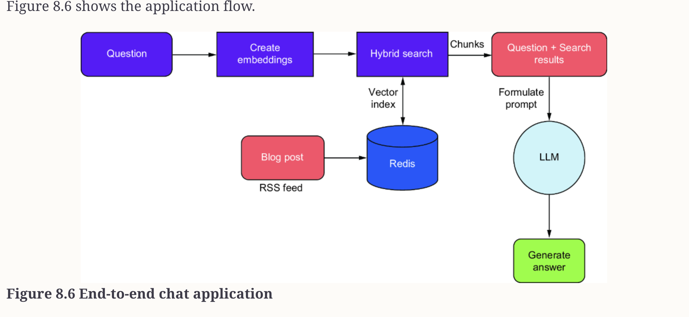

# Generative AI  in action :
###### Ref : https://learning.oreilly.com/library/view/generative-ai-in/9781633436947/Text/chapter-8.html#sigil_toc_id_138
### This folder explain the RAG pattern in details, how it work and how to use it
### We will list down the steps for loading the data into redis as vector database.
## Vector database : Redis : Load data
*  Please use the [redis-compose.yml](redis-compose.yml) file to up the redis DB.
* You can access the Redis UI : http://localhost:8001/redis-stack/browser
* Once the vector DB is up, you can load the data into into it using script [loading_vector_data_into_redis.py](loading_vector_data_into_redis.py)

## Vector database : Redis : Search data
* You can search the data using the script : [search_redis_vectors.py](search_redis_vectors.py)
* You can find the embedding and everyting is simlar as per loading into data.
* Example for search is below 
```
ankush.nakaskar@PP-M4QYWHM2GC ai_agent_in_action % python3 generative_ai_in_action_RAG/search_redis_vectors.py          
Loading local embedding model...
Warning: You are sending unauthenticated requests to the HF Hub. Please set a HF_TOKEN to enable higher rate limits and faster downloads.
<All keys matched successfully>

Enter your query: Tell me about Longhorn
Vectorizing query...
[transformers] Detected the usage of `get_extended_attention_mask`: This function is deprecated and will be removed in v5.12.0. Please use the new API in `transformers.masking_utils`
Searching for similar posts...

Found 3 matching post(s):

============================================================
[1] Living La Vida Longhorn (Similarity Score: 0.6531)
Link: https://blog.desigeek.com/post/2004/05/living-la-vida-longhorn/
Content snippet: <p>You probably already heard this, but <a href="http://www.sellsbrothers.com/" rel="nofollow noopener noreferrer" target="_blank">
        
        <span>
                <strong>Chris Sells</strong>
        </span>
</a> has a new col...
------------------------------------------------------------
[2] Longhorn Released on MSDN! (Similarity Score: 0.6482)
Link: https://blog.desigeek.com/post/2004/05/longhorn-released-on-msdn/
Content snippet: <p>Yipeee! I you are a MSDN Universal subscriber - you can download the version they handed out at WinHEC!<p>

    

</p></p>...
------------------------------------------------------------
[3] Longhorn Super-Duper-Secret Screen shot (Similarity Score: 0.6269)
Link: https://blog.desigeek.com/post/2005/07/longhorn-super-duper-secret-screen-shot/
Content snippet: <p>Here is the new file copy dialog box in Longhorn (via Karan):</p>
<p><p>

    

</p></p>
<p>Sorry, was just too good to pass up. *grin*...
------------------------------------------------------------
ankush.nakaskar@PP-M4QYWHM2GC ai_agent_in_action % 

 ```

### RAG pattern using Vector DB now look like below : 


* As explain in diagram : 
  * The question the user asks first gets converted into embeddings and then searched in Redis using a hybrid search index to find similar chunks, which are returned as search results. 
  * As we saw earlier, the blog posts have already been injected into the Redis database and indexed. Once we have the results, we formulate the LLM prompt by combining the original questions and the chunks retrieved to answer from. 
  * These are passed into the prompt itself before finally calling the LLM to generate a response.
* Now the final RAG pipeline where we submit the Vector DB response and get the human-readable output, you can refer to : [rag_pipeline.py](rag_pipeline.py)